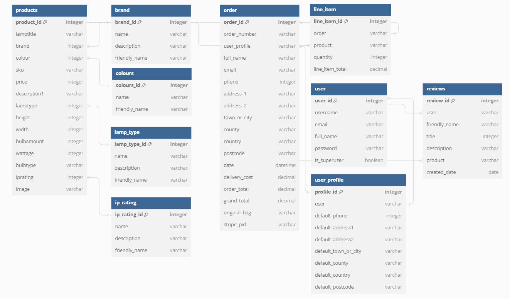

# Boho Bulbs


View the deployed site: [Boho Bulbs](https://caravansy-project.herokuapp.com/)

This is Boho Bulbs, an ecommerce website for users to buy lamps. The website will enable users to browse the products, add them to a shopping and purchase them, as well as to created their own account to keep track of their purchases.

Python, Javascript, HTML and CSS will be the languages used to create this website.

# Table of Contents

# USER EXPERIENCE (UX)

## Project Goals
### User Goals:

As a buyer, I want to:

- be able to view all the products available
- view details of each individual each lamp
- search for certain charateristics for lamp I desire
- create my own account to keep track of my purchases

### Site Owner Goals:

- allow users to browse and search all available products
- allow users to create an account to store their details and purchases
- be able to list available products
- ensure quality listings - through management of products

### User Requirements and Expectations
* A simple and intuitive navigation system
* An easy way to browse products
* A clear way to see details of each product
* Good presentation and a visually appealing design regardless of screen size
* Accessible for all users

## User Stories

| | As a / an | I want to be able to… | So that I can…  |
|----|----|----|----|
| Viewing and Navigation |   |   |   |
| 1 | Site Visitor | View a list of products                   | Select a product to view more details                               |
| 2 | Site Visitor | View a specific category of products      | Find the type of product I want quickly                             |
| 3 | Site Visitor | View individual product details           | View the description, product specification, price, product image   |
| 4 | Site Visitor | View the total of my shopping bag         | Keep a check on my spending                                         |
| Registration / User Accounts |   |   |   |
| 5 | Site Visitor | Easily register for an account            | Store my personal details and view my purchase history              |
| 6 | Site Visitor | Easily log in and out                     | Access my account and keep it safe                                  |
| 7 | Site Visitor | Reset my password                         | Gain access to my account                                           |
| 8 | Site Visitor | Verify my email address after registering | Keep my account secure and know registration was successful         |
| 9 | Site Visitor | Have a user profile                       | Store my personal details and view my purchase history              |
| Sorting / Searching |   |   |   |
| 10 | Site Visitor | Sort the available products               | View the products best suited to my needs and budget                |
| 11 | Site Visitor | Sort by specific category                 | View the products best suited to my needs and budget                |
| 12 | Site Visitor | Sort by multiple categories simultaneously| Narrow down my product list                                         |
| 13 | Site Visitor | Search for a product by name or description| Find a product suited to my needs                                  |
| 14 | Site Visitor | Easily see what I have searched for       | See if the product type I want is at the site                       |
| Purchasing / Checkout |   |   |   |
| 15 | Site Visitor | Select the quantity of the product        | Select the right amount that I need                                 |
| 16 | Site Visitor | View items in my bag to be purchased      | View the total cost of my bag                                       |
| 17 | Site Visitor | Adjust the quantity once in the bag       | Easily make changes before checkout                                 |
| 18 | Site Visitor | Securely enter payment information        | Checkout safely and securely                                        |
| 19 | Site Visitor | View confirmation of a successful order   | Confirm I ordered correctly                                         |
| 20 | Site Visitor | Receive a confirmation email              | Confirm I ordered correctly and keep a record of them               |
| Profile / Product Management |   |   |   |
| 21 | Site Visitor | Add a product                             | Add new products as they come in                                    |
| 22 | Site Visitor | Edit a product                            | Update/change product details                                       |
| 23 | Site Visitor | Delete a product                          | Remove products that are no longer available                        |

# Design

## Wireframes

To help cement the framework of the site while designing, I created wireframes using Balsamiq

- [Home](media/home-wireframe.png)
- [Products](media/products-wireframe.png)
- [Product Details](media/product-details-wireframe.png)
- [Product Management](media/product-management-wireframe.png)
- [Bag](media/bag-wireframe.png)
- [Checkout](media/checkout-wireframe.png)
- [Profile](media/profile-wireframe.png)

## Colour

The colour palette was design to be clear and simple, with the ability to highlight important pieces of information.

Green #8f967d
White #fff
Black #000


## Typography

[Google Fonts](https://fonts.google.com/) was used to obtain fonts used.

The Roboto font is the font used throughout the site, in different weights and font-sizes. This keeps the simplicity of the site in focus. It is used frequently by many web developers and is easy on the eye.

## Database Design

To help visualize my database, I created a diagram using [DBDiagram](https://dbdiagram.io/home) which shows the relationships between the models.



The Product model stores information about each product. 

The Brand, Colours, Lamp Type, IP Rating models are used to group products into specific categories.

The User Profile model stores individual user profile details and order history.

The Order model is used to store orders. 

The OrderLineItem model stores information about each product on the order. 

# Features

## Navigation and Flow

Navigation was designed for ease of use and natural flow for the user. The user can select the Boho Bulbs logo to head to the home page at any point in their journy. Users can filter the products they are viewing by using the main menu bar, which is displayed to the user at all times. They can filter further by adding more criteria to their filters using the secondary navigation. Users can see their filters by looking at the filtered by tags. There are various additional ways a user can filter, for example, by pressing the IP rating displayed on an individual product page. That will then give them a view of all the products with that IP rating

## Home
A simple view to introduct the company and set the brand tone. Users can use the navigation bar to access products.

## Products
Products are displayed in cards with pertinent information displayed including the product image, name, colour, brand and price.
Product details are access by pressing one of the cards. An accordian displays extra inforamtion including a description, specification and shipping details.
Products can be added via the product management link via the My Account link on the top right hand side of the page.
Editing and deleting individual products can be done via the products or product details page by super users only.

## Bag
Users may add products to their bag via the product details page. They can adjust the quantity or remove the item from the bag at any time by clicking on the bag icon on the top right hand side of the screen. The shopping bag intentionally functions as users are used to. This reduces the learning curve and familiar to users.
Users can access the secure checkout by viewing their bag and clicking the 'Secure Checkout' button or alternatively head back to do more shopping by clicking the 'Keep Shopping' button.

## Checkout

The checkout page gives users a summary of their order including the subtotal, delivery price and grand total. It also advises the user if the can get free delivery by showing them how much more they need to purchase. 
Crispy forms is used for elegant formatting and allow the user to input their contact details, delivery details and card details.
Stripe is used to manage the card transactions.
Users can check the 'save info' field if they are logged in to save their details for next time.

Once the checkout is submitted, users are redirected to a success page which confirms their order details and delivery details. They are informed of where the confirmation email will be sent to.

## Profile

Crispy forms are once again used here for a clean design. Users can view and update their details including phone, email, address and ensure they are kept for future use.

## Other

Toasts are used to display success, info, alert or error messages to the user to keep them informed throughout their journey
Users can search for products using the search bar / icon displayed on all pages. This will search the product name and description for relevant products to display.

# Technologies

## Languages
- HTML 5
- CSS 3
- Javascript
- Python

## Third Pary Technologies

- Django - Python web framework
- Git - version control
- Github - store project code
- Heroku - live deployment
- ElephantSQL - store data
- Bootstrap 5.3 - CSS styling and responsiveness
- Boto3 - python SDK for AWS
- Gunicorn - WSGI server
- Pillow - python imaging library
- Psycopg2 - database adapter
- AWS - cloud storage for images
- Stripe - handle payments
- Temp Mail - temporary email for testing confirmation emails
- Google Fonts - Import fonts for project
- Font Awesome - Import iconfs for project
- Balsamiq - create wireframes for project
- W3 Validator - validate HTML files
- W3C CSS Validator - validate css files
- JShint - validate javascript files
- python checker - validate python files
- Favicon - create favicon for project
- I Am Responsive - multi device mockup

# Deployment

The project was deployed to Heroku and was set to automatically update when deployed to GitHub.

Images for live deployment were kept on AWS. Images can be downloaded from this repo's media file.

Set up a Gmail account with a app secret password to allow email to be sent to users. Click [here](https://accounts.google.com/InteractiveLogin/identifier?elo=1&ifkv=ASKXGp0kWgqx7EL5Vdr6fO9rQq5IjbWAqUYBnKS8ml_Oy3cug5BbxQrXyE_PazSi5w5EhcVl6TqSqA&theme=glif&flowName=GlifWebSignIn&flowEntry=ServiceLogin) to create a new Gmail account

Stripe set up documentation can be found [here](https://stripe.com/docs) 

<p>
<details>
<summary>Deploying to Heroku</summary>
<p>

1. Install the project requirements by creating a requirements file <br>

In the terminal, enter the command ```pip3 freeze > requirements.txt``` and a file with all the requirements will be created.

2. Create an external database on ElephantSQL.com <br/>
To create a database for use in live deployment:

* Go to [ElephantSQL.com](https://www.elephantsql.com/) and click *Get a managed database today* button.
* Select Tiny Turtle by pressing the *Try now for FREE* button
* Select *Log in with GitHub* and authorize ElephantSQL with your selected GitHub account
* In the create new team form:
    * Add a *team name*
    * Read and agree to the Terms of Service
    * Select *Yes* for GDPR
    * Provide your email address
    * Click *Create Team*
* Click *Create New Instance*

If you already have an account, after logging in to ElephantSQL:
* Set up your plan
    * Give your plan a **Name** (This is commonly the name of the project)
    * Select *Select Region*
    * Select a region and data center (Choose the one closest to you)
    * Click *Review*
    * Check that your details are correct and then click *Create New Instance*
    * Return to the dashboard and click on the *database instance name*
    * Copy the database url

3. Set up Heroku <br>
* Go to [Heroku.com](https://www.heroku.com/) and log in (register if you haven't already)
* Choose the New button and from the dropdown, select *Create new app*
* Add the app name and select your location and click the create app button
* Add the Config Vars by going to the settings tab
* Click *Reveal Config Vars*
* Add the following:

| Key               | Value               |
|-------------------|---------------------|
| AWS_ACCESS_KEY_ID | Find in AWS         |
| AWS_SECRET_KEY_ID | Find in AWS         |
| USE_AWS           |        TRUE         |
| DATABASE_URL      | To be added by user |
| EMAIL_HOST_PASS   | To be added by user |
| EMAIL_HOST_USER   | To be added by user |
| SECRET_KEY        | To be added by user |
| STRIPE_PUBLIC_KEY | Find in Stripe      |
| STRIPE_SECRET_KEY | Find in Stripe      |
| STRIPE_WH_SECRET  | Find in Stripe      |

4. Link Gitpod to the Database

    * In your **env.py** file add a new key, **DATABASE_URL** and give it the value of the copied database URL <br/>
```bash
os.environ.setdefault("DATABASE_URL", "the_copied_database_url")
```
* Install the **dj-database-url** package version 0.5.0 and **psycopg2** in the terminal with **pip3** to allow us to parse the URL we have copied above to a format that Django can work with: <br/>
```bash
pip3 install dj_database_url==0.5.0 psycopg2
```
* add both to the **requirements.txt** file: <br/>
```bash
pip3 freeze --local > requirements.txt
```
* In the **settings.py** file, import **dj_database_url** underneath the import for os <br/>
```python
import os
import dj_database_url
```
* In the **settings.py** file, comment out the default database setting and replace it to use the **DATABASE_URL** environment variable <br/>
```python
DATABASES = {
    'default': dj_database_url.parse(os.environ.get('DATABASE_URL'))
}
```
* Run the showmigrations command in the terminal to confirm you are connected to the external database
```bash
python3 manage.py showmigrations
```
**Note:** this does not transfer the data, only the database structure
* If you are connected to the external database, you should see a list of migrations, but none of them are checked off
* Run the migrate command in the terminal
```bash
python3 manage.py migrate
```

5. Transfer Data

Connect to the external database
* In **settings.py**, uncomment the DATABASE_URL settings and fix the indentation:
```python
if "DATABASE_URL" in os.environ:
    DATABASES = {"default: dj_database_url.parse(os.environ.get("DATABASE_URL"))"}
else:
    DATABASES = {
        "default": {
            "ENGINE": "django.db.backends.sqlite3",
            "NAME": os.path.join(BASE_DIR, "db.sqlite3"),
        }
    }
```
* Save the **settings.py** file
 GitPod is now connected to the external database. Run **migrate** just to make sure that the latest migrations are applied to this external db:
 ```bash
 python3 manage.py migrate
 ```
**Loaddata**
* Use **loaddata** to upload JSON files by running the following command for each file in the fixtures folder:
```bash
python3 manage.py loaddata <filename>
```
Ensure you these files (brands, colours, ip_rating, lamp_type) are loaded first and then the products file. As the products are dependent on the different categories

If everything went well with the upload, you should see something like this on the terminal:

* Create a superuser for the database
```bash
python3 manage.py createsuperuser
```
Follow the steps to create your superuser username and password.

6. Deploy to Heroku

    * Install **gunicorn** as the webserver and add to requirements.txt:
```bash
pip3 install gunicorn
pip3 freeze > requirements.txt
```
* Create a **Procfile** in the root directory to tell Heroku to create a web dyno to run gunicorn and serve the Django app.
```Procfile
web: gunicorn boho_bulbs.wsgi:application
```
* Temporarily disable **collectstatic** by logging into the Heroku CLI in the terminal to tell Heroku not to collect static files when we deploy:
```bash
heroku config:set DISABLE_COLLECTSTATIC=1 --app heroku-app-name
```
* Add the hostname of the Heroku app to allowed hosts in **settings.py**:
```python
ALLOWED_HOSTS = ['heroku-site-url']
```
* Save the **settings.py** file and commit to GitHub.
* Deploy to Heroku using ```git push Heroku main```.

7. Secret Key

* Generate a secret key and store in env.py and Heroku Config Vars.

8. Set Up AWS for Image Storage

**Create an account** <br/>
* Visit [aws.amazon.com](https://aws.amazon.com/) and click on *create an aws account* by filling in your email and a password and choose a username for the account and select *continue*
* On the account type, select *personal*, fill out the required information, and click *create account and continue*
* Enter the credit card number which will be used for billing if the account goes above the free usage limits
* Complete the verification and once you confirm all the required information, your account will be created.
**Create a bucket**
* Search for and select S3 
* Click the *create bucket* button and on the general configuration section, add the name of your bucket. 
* Select the region closest to you
* On the Object Ownership section, select *ACLs enabled* and a bucket ownership dropdown will appear, select *Bucket owner preferred*
* On the Block Public Access settings for this bucket section, uncheck *Block all public access*, check the *I acknowledge that the current settings might result in this bucket and the objects within becoming public* checkbox to make the bucket public and click *create bucket*
* Click the bucket you created and select the *properties* tab. Scroll down to find the *static web hosting* section and select *enable static web hosting*, tick *host a static website* and add *index.html* and *error.html* to the input fields for **Index document** and **Error document** respectively and click *save*.
* Open the permissions tab and copy the ARN (Amazon Resource Name). Navigate to the bucket policy section, click *edit* and select *policy generator*. From the *Select Type Policy* dropdown options, select S3 bucket policy. Allow all principals by adding the `*` to the input and the from the *Actions* dropdown, select *GetObject*.
* Paste the ARN we copied into the ARN (Amazon Resource Name) input field and click *add statement*, then click *generate policy*, copy the Policy from the new popup and paste it into the bucket policy editor and add `/*` at the end of the resource value to allow access to all resources in this policy and finally, click *save*.
* For **cross-origin resource sharing (CORS)** configuration, paste the code below to the CORS section:
```json
[
  {
      "AllowedHeaders": [
          "Authorization"
      ],
      "AllowedMethods": [
          "GET"
      ],
      "AllowedOrigins": [
          "*"
      ],
      "ExposeHeaders": []
  }
]
```
* For the **Access control list (ACL)** section, click *edit* and tick *List* for **Everyone (public access)** and accept the warning box. If the edit button is disabled you need to change the **Object Ownership** section above to **ACLs enabled**.

**Create Group, Policies and Users using AWS's Identity and Access Management (IAM) service**<br/>
* Search for and select IAM and navigate to create a group. Create an access policy to give the group access to the S3 bucket and assign the user to the group so it can use the policy to access the files.
* Start by creating a group by selecting **User Groups** and click *create group*
* Add a name for your group, then click *create policy* button
* Open the *JSON* tab on the new page and click the *import managed policy* link on the top right side of the page
* Search for S3 and select the pre-built *AmazonS3FullAccess* policy and click *import*
* Edit the policy by pasting the S3 ARN on *resource*, ie:
```json
{
    "Version": "2012-10-17",
    "Statement": [
        {
            "Effect": "Allow",
            "Action": "s3:*",
            "Resource": [
                "arn:aws:s3:::bucket-name",
                "arn:aws:s3:::bucket-name/*",
            ]
        }
    ]
}
```
* Click the *next* button and then *next: review*
* Give the policy a name, description then click the *create policy* button
* Attach to the Group the policy we just created. Go to *User Groups*, select the group and go to the permissions tab, click the *add permissions* button and select *attach policies* from the dropdown.
* Select the Policy you created and click *add permissions*
* We have to create a user for the group. Click *Users* from the left sidebar and then click the *add users* button and add a name for the user, eg. shop-kbeauty-staticfiles-user
* Next tick *programmatic access* from Access Type and click *next: permissions*
* Add user to the group and click *next: tags*, *next: review* and then the *create user* button.
* The download the .csv file which will contain this user's access key and secret access key which we'll use to authenticate them from our Django app.


9. Connect Django to S3

* Install these packages: **boto3** and **django-storages**
```bash
pip3 install boto3
pip3 install django-storages
pip3 freeze > requirements.txt
```
* Add `storages` to the installed apps in **settings.py**
* Also on **settings.py**, add the bucket configuration:
```python
    if 'USE_AWS' in os.environ:
        AWS_S3_OBJECT_PARAMETERS = {
            'Expires': 'Thu, 31 Dec 2099 20:00:00 GMT',
            'CacheControl': 'max-age=9460800',
        }

        AWS_STORAGE_BUCKET_NAME = 'bucket name'
        AWS_S3_REGION_NAME = 'selected region'
        AWS_ACCESS_KEY_ID = os.environ.get('AWS_ACCESS_KEY_ID')
        AWS_SECRET_ACCESS_KEY = os.environ.get('AWS_SECRET_ACCESS_KEY')
        AWS_S3_CUSTOM_DOMAIN = f'{AWS_STORAGE_BUCKET_NAME}.s3.amazonaws.com'
```

10. Setting  up Stripe

 Log in to Stripe, click the *developers* tab, and then *API Keys*
* Add them as Config Vars in Heroku
* Now we need to create a new webhook endpoint since the current one is sending webhooks to our gitpod workspace. We can do that by going to webhooks in the developer's menu and clicking *add endpoint*.
* Add the URL for our Heroku app, followed by /checkout/WH and select *receive all events and add endpoint*.
* We can now reveal our webhooks signing secret and add that to our Heroku config variables.

---
## How to Fork the repository
To create a copy of the repository on your account and change it without affection the original project, click the *Fork* button on GitHub:
* On the repository, click the *Fork* butoon on the top right side of the page.
* A forked version will be available as one of your repositories on GitHub

---
## How to Clone the repository
* On the repository page, click the *<> Code* button (left of the green *GitPod* button)
* Choose from *HTTPS, SSH and GitHub CLI* and *copy the link* given
* On your IDE, open *Git Bash*
* Enter the command `git clone` followed by the copied link
* Set up a virtual environment if not using the Code Institute template
* To install the packages from the requirements.txt file
```bash
pip3 install -r requirements.txt


# Credits

[Code Institute - Boutique Ado Walkthrough](https://codeinstitute.net/)
[Django Documentation](https://www.djangoproject.com/)
[Product Images courtesy of Lighting Company](https://www.lightingcompany.co.uk/ ) 
[Hero images from Pexels]( https://www.pexels.com/)
[URL Encoding and Decoding]( https://www.youtube.com/watch?v=lkAeX3T6A9I)
[Use of request.GET.items  from Django Central ](https://djangocentral.com/capturing-query-parameters-of-requestget-in-django/)
[Django Countries](https://pypi.org/project/django-countries/#installation)
